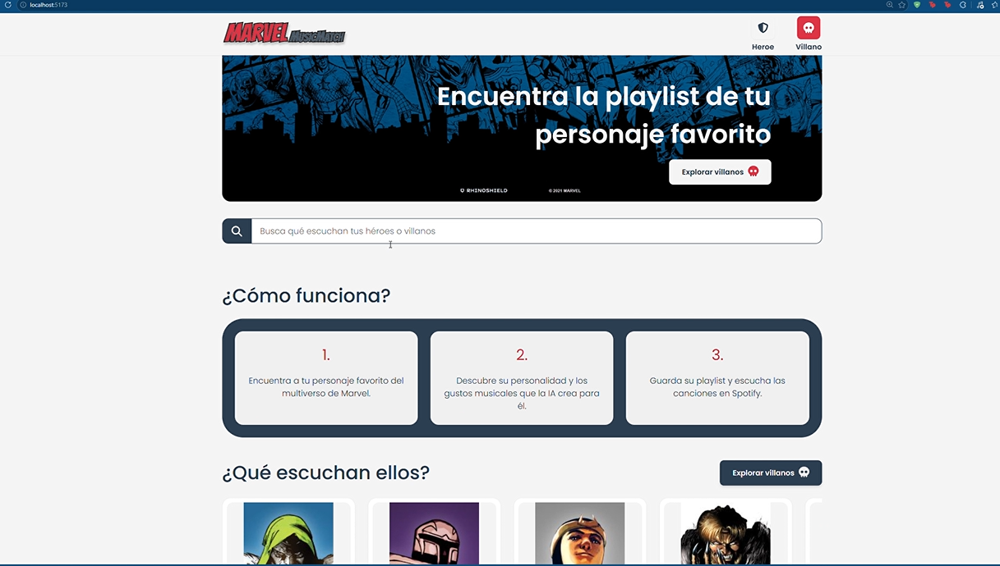
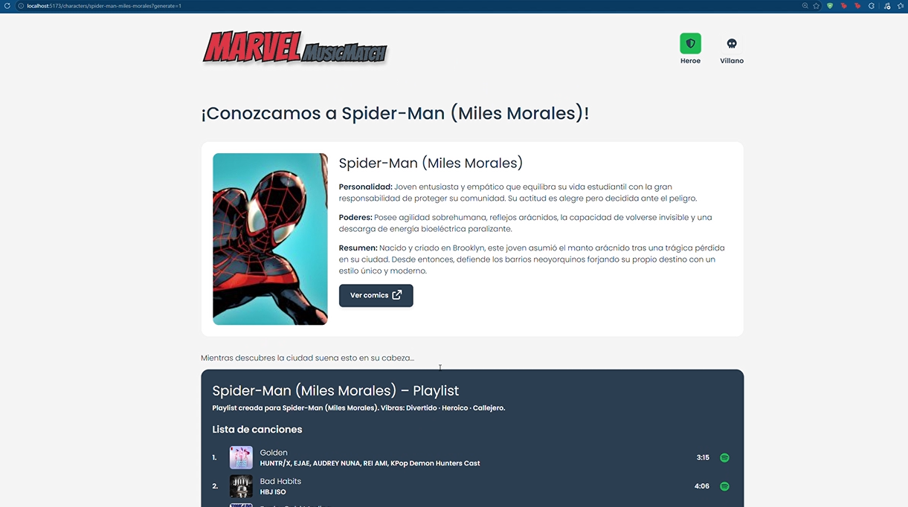

# Marvel Music Match

Marvel Music Match es una aplicación web donde los fans de Marvel descubren
playlists personalizadas inspiradas en sus personajes favoritos: eliges un héroe
o un villano, la IA describe su **personalidad, poderes e historia**, y la app
arma una playlist con **canciones reales de Spotify**.

> Estado: **Fase 1** (sin autenticación).

## Capturas

| Home | Detalle del personaje |
| :---: | :---: |
|  |  |

> Las imágenes van en `docs/capturas/` con los nombres `home.png` y `personaje.png`.

## Características

- **Modo héroe / villano:** el sitio arranca en modo héroe y al cambiar a villano
  se filtran los personajes y los acentos verdes pasan a rojo.
- **Catálogo de 100 personajes:** los más populares de Marvel, servidos desde
  MongoDB con búsqueda por nombre y filtro por rol.
- **Perfil generado por IA:** personalidad, poderes y resumen, redactados en
  español a partir de la descripción oficial (o de una búsqueda en internet si
  falta información).
- **Playlist con Spotify:** las vibras musicales del personaje se traducen en
  búsquedas de canciones reales.
- **Playlists guardadas:** se pueden guardar y aparecen en la sección
  "Playlist populares", filtradas por el rol activo.
- **Interfaz responsive:** carruseles con navegación, navbar que se mantiene
  visible, skeletons de carga y diseño basado en el design system.

## ¿Cómo funciona?

1. El usuario entra a la web (**modo héroe** por defecto) o cambia a villano.
2. Elige un personaje del catálogo o lo busca por nombre.
3. La IA redacta **personalidad, poderes y resumen**, y clasifica sus vibras
   musicales dentro de una taxonomía cerrada.
4. Cada vibra se convierte en términos de búsqueda y se obtienen **canciones
   reales de la API de Spotify**.
5. El usuario escucha la playlist en Spotify o la guarda para reutilizarla.

## Personajes y dataset

La API pública de Marvel **fue dada de baja**, así que los personajes se cargan
desde un dataset local:

- Fuente: [Marvel Characters (Kaggle)](https://www.kaggle.com/datasets/iamabhaytiwari/marvelcharacters)
- Archivo: `backend/data/marvel_characters.csv` (descargar y colocar ahí)
- Script: `backend/src/scripts/generateTopCharacters.ts`

El script calcula el **Top 100** y lo carga en MongoDB. El backend sirve el
catálogo desde MongoDB (`characterService`), sin depender de la Marvel API:

```bash
cd backend
npm install
npm run seed:characters                  # genera el JSON y siembra MongoDB
npm run seed:characters -- --skip-seed   # solo genera el JSON
```

Criterios de relevancia aplicados:

> **Popularity Score**: calculated from the character's number of appearances across comics, series, stories and events in the source dataset.

Además del score se excluyen los equipos y organizaciones (X-Men, Avengers,
S.H.I.E.L.D., Inhumans, etc.), los personajes sin apariciones y los que no tienen
imagen real (`image_not_available`). El campo `role` (héroe/villano) no viene en
el dataset: se investigó para **97 de los 100** personajes; los 3 restantes son
civiles no combatientes y quedan en `null`.

## Proveedores de IA

El perfil del personaje lo puede generar cualquiera de estos dos proveedores
(configurable con `AI_PROVIDER`):

| Proveedor | Modelo por defecto | Búsqueda en internet |
| --- | --- | --- |
| **OpenAI** | `gpt-4o-mini` | Sí (`web_search`) |
| **Google Gemini** | `gemini-3.6-flash` | Sí (Google Search) |

Con `AI_PROVIDER=auto` (por defecto) se intenta **OpenAI primero** y, si falla
(sin créditos, cuota, etc.), se usa **Gemini** como respaldo. Gemini además rota
entre varios modelos cuando alguno está saturado o agotó su cuota, y si el
usuario pulsa **"Regenerar"** se reutiliza el perfil y solo se vuelven a buscar
canciones.

## Tecnologías utilizadas

**Frontend**
- **React 19** + **TypeScript** + **Vite**
- **Tailwind CSS** con el design system del proyecto
- **React Router** para las rutas
- **Font Awesome** para los iconos

**Backend**
- **Node.js** + **Express 5** + **TypeScript**
- **MongoDB** + **Mongoose** para el catálogo y las playlists
- **Spotify Web API**, **OpenAI** y **Google Gemini**
- **dotenv** para variables de entorno y `fetch` nativo para las peticiones HTTP

**Datos**
- Dataset de personajes de Kaggle procesado con `csv-parse`

## Instalación

1. Clona el repositorio:

   ```bash
   git clone https://github.com/RickC1218/MarvelMusicMatch.git
   cd MarvelMusicMatch
   ```

2. **Backend**

   ```bash
   cd backend
   npm install
   cp .env.example .env
   ```

   Completa `backend/.env`:

   | Variable | Descripción |
   | --- | --- |
   | `MONGO_URI` | URI de MongoDB (tiene prioridad sobre las variables sueltas) |
   | `SPOTIFY_CLIENT_ID` / `SPOTIFY_CLIENT_SECRET` | Credenciales de Spotify |
   | `SPOTIFY_MARKET` | Mercado de las búsquedas (ej. `US`) |
   | `OPENAI_API_KEY` | Clave de OpenAI |
   | `GEMINI_API_KEY` | Clave de Google Gemini (respaldo) |
   | `AI_PROVIDER` | `auto`, `openai` o `gemini` |

   Descarga el dataset y colócalo en `backend/data/marvel_characters.csv`, luego:

   ```bash
   npm run seed:characters   # carga los 100 personajes en MongoDB
   npm run dev               # http://localhost:5000
   ```

3. **Frontend** (en otra terminal)

   ```bash
   cd frontend
   npm install
   npm run dev               # http://localhost:5173
   ```

   Vite hace proxy de `/api` hacia `http://localhost:5000`, así que no hay que
   configurar CORS. Para probar sin backend, crea `frontend/.env.development.local`
   con `VITE_USE_MOCKS=true` y usa datos de ejemplo.

## Uso

1. Entra a `http://localhost:5173`. Verás el **Home** en modo héroe.
2. Cambia a **Villano** en el navbar para ver los villanos y los acentos en rojo.
3. Haz clic en un personaje → **Crear playlist**. La IA redacta su perfil y se
   buscan canciones en Spotify.
4. Escucha la playlist en Spotify o pulsa **Guardar playlist** para que aparezca
   en "Playlist populares".

## Contribuciones

¡Las contribuciones son bienvenidas! Por favor, abre un issue o haz un pull request para sugerir mejoras.

## Licencia

Este proyecto está bajo la licencia MIT.
